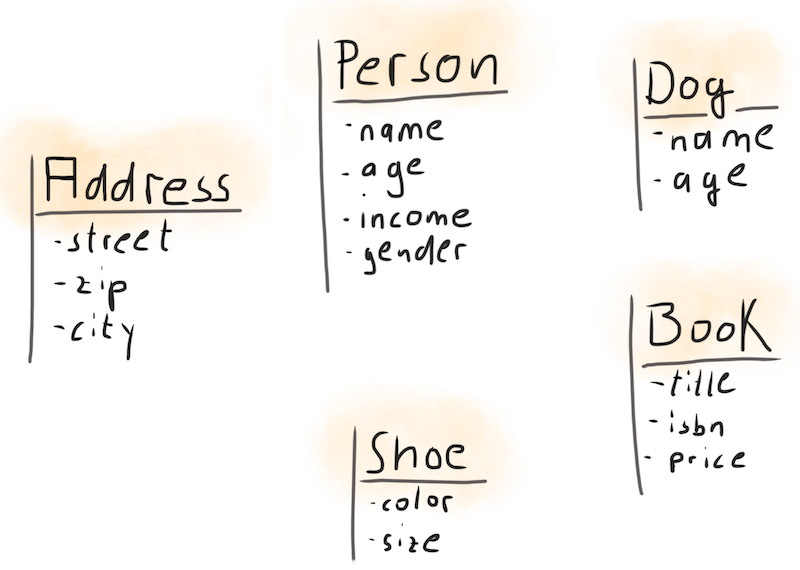
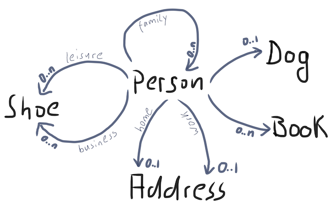
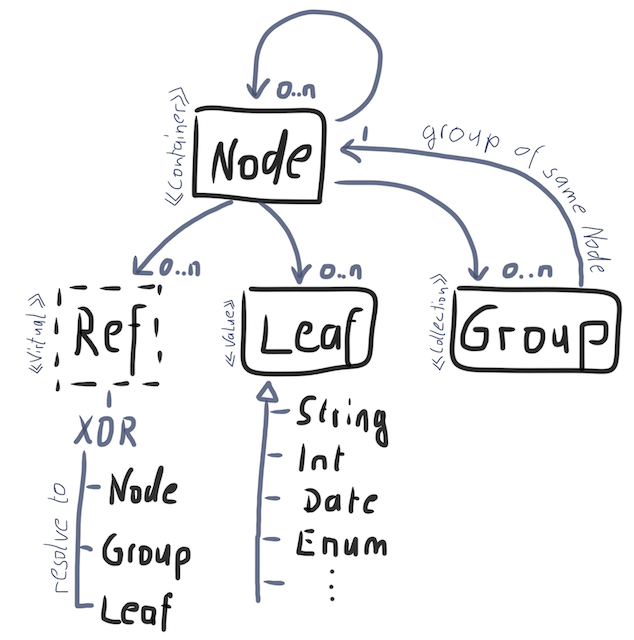

# Intro
Applications work with domain models that are usually very specific to their target domain. Yet, they
often lack generic APIs. This is pretty natural, since the closer the model is to a problem domain, 
the harder it is to keep it generic.
The project serves as a playground to work out a design that supports a number of features along a
simple sample model. By model we mean **data structure**.
Ultimately the building blocks might be combined with code generators.

Of course the design is very opinionated as features come always on a price!

## Getting started
- You need JDK >= v11
- Clone this repo
- Current status: very raw yet but concepts start to emerge

## Who might be interested?
In the first place it is a personal experimental ground. You can borrow ideas and concepts but 
nothing is "ready-as-a-lib" - here.

In case you have a rather sophisticated graph-based data model and you need to:
- track changes
- diff recursively between versions
- want to serialize your (sub)graph without resorting to reflection
- compress your graph to the min attribute set
- support transactional semantic on your graph with commit/rollback
- version changed nodes
- back it by a meta model
- generate domain classes and meta model from structured data

## Typical use cases
- model manipulated in state engines
- model derived from industry specifications
- central governance of models in a structured format (e.g. xml, json, xls)
- if you prefer design patterns over annotations and reflections ;)

## Sample domain model
The focus is to cover standard requirements around data structures used to reflect a model. 
Such as:
- values ... primitives and specific types
- containers ... a combination of values and other containers
- associations ... form a graph of containers
- types ... reflecting the domain
- idiomatic ... the model should feel natural and not impaired by some underlying framework

### Everyone knows "Person-has" stuff
The sample domain makes use of basic attributes (String, BigDecimal, long, enums) along with 
different kind of relationships.
 

### Relationships types
- 0..1 ... optional association by unique reference from 1 container to another by default name (Person -> Dog)
- 0..n ... from 1 container to (potentially empty) collection of containers by default name (Person -> Books) 
- 0..1 ... different semantic containers type by reference (Person -> homeAddress; Person -> workAddress)
- 0..n ... different semantic collections type by reference (Person -> leisureShoes; Person -> businessShoes)
- 0..n ... recursive relation to collection of same type (Person -> family)

### Backing data structures

The semantic wrappers of the sample model all delegate to a few data data structures. 
- value is represented by **Leaf** -> matching fields in classes
- values are contained in **Node**. A node contain contained other nodes. -> matching classes
- **Group** is the collection to reflect 0..n relationships. A group can be made up of nodes.
- **Ref** serve as a named (and uniquely tagged) alias to other primitives (leaf, node, group).

## Features
The domain model is a set of data classes. Support non-cyclical object graphs where classes are 
declared in a generic way to allow code generation.

- [x] The model is described by a meta model which is generated as well. The meta model 
    enables generic access and manipulation of the target model. The meta model will be generated as 
    well.

- [ ] Values are reflected by **leafs** in the graph. 'Person.name' is obviously different from 
    'Person.Dog.name' (Person.name vs. Dog.name). Their identity is determined by their path in the 
    graph. 

- [x] Leafs can refer to primitive types (int, boolean, ...) as well as to objects (Date, 
    BigDecimal, ...). The former ones will _not_ be auto-boxed. All access to the proprietary domain 
    model is strongly typed.

- [x] Values are atomic whereas **nodes** are a collection of values or nodes.

- [ ] Domain objects offer different types of access:
    - random semantic access ... e.g. Person.setName("Joe")
    - generic access ... Person.getLeaf(MetaPerson.NAME).setValue("Joe")
    - sequential generic access ... iterate (recursively) over all properties of Person

- [ ] Every node/leaf in the graph can be addressed by forming a path of the meta model and its' 
    location in the graph.

- [ ] Minimize memory footprint. Leafs/nodes that are 'empty' are discarded - including 
    their references. If 'Person' has just the attribute 'name' set, no memory will be allocated for 
    any other domain attribute. 

- [ ] Provide NullPointer safety by lazy initialization. Traversing 'Person.Dog.name' will create an 
    empty 'Dog' node, if it does not exist yet. This applies to all kind of nodes. If node is left 
    empty it will be automatically removed. (Might be configurable behaviour to avoid garbage) 
 
- All nodes/leafs support recursive operations as outlined below. Access is provided as described in 
    "types of access"
    - [x] empty ... does not carry domain data
    - [x] changed ... data was un/set (a.k.a "dirty flag")
    - [x] commit/rollback ... to apply/revert recent model changes in memory
    - [ ] diff ... extract changed structures in any combination of AND/OR/NOT(before,after)
    - [ ] freeze ... prevent a node/leaf to be mutated
    - [ ] copy constructors ... to create im/mutable clones
    
- [ ] Nodes might have a version and different version schemes might be used (pluggable). 
    Versions start with -1 (unsaved) and increment by 1 on any change commit.
    - Version will be incremented if one of its direct children changed. So one graph would maintain
        multiple versions.
    - Only one version on aggregate root is maintained
 
## Optional features
- [ ] Pending values ... are of interest in scenarios that involve review cycles.
    E.g. a requested 'Person.name' change might involve an approve/reject step. So until the name 
    change is approved the new name is pending (= inactive). On approval - the current name is replaced 
    with the new one. If rejected - the new name value is discarded and the current one is preserved. 
    If multiple such fields exist, a generic API activates/discards all pending values.

- [ ] Rippling attributes (or complete structures) ... in case attributes are duplicated across nodes
    in a tree, they have to be kept in sync. E.g. 'last name' needs to be propagated across all persons
    in this tree. Such functionality could also be kept separate from core model. Having a good concept
    of "pseudo inheritance" of attributes (leaf/node) offers potentially great performance improvements 
    for deeper but uniform trees. Left open:
    - ripple up/down
    - link instead of copy
    - define ripple boundaries
    - reflect in declarative model to allow generation
   

## Optimization options
- propagate dirty flags up to root to mark dirty paths. Consider mark dirty and clean
- all 1 -> 0 .. 1 classes could share attributeMap from parent, requires full path as key 
    to avoid ambiguity person.name vs. dog.name
- recycle objects
- avoid auto boxing
- init maps on demand: e.g. DataContainer, Group
- lazy init based on test evidence, in the meanwhile remove lazy init for predictability 

## Gaps in model design
- missing: support component A has named references B.1 and B.2 
  (e.g. Person has private Address and work Address)
- move all classes behind interface to allow extension
- convert Descriptor to interface to allow enum vs. class hierarchy for meta model
- make it usable as library vs. framework
- efficient extension model for object vs. native values
